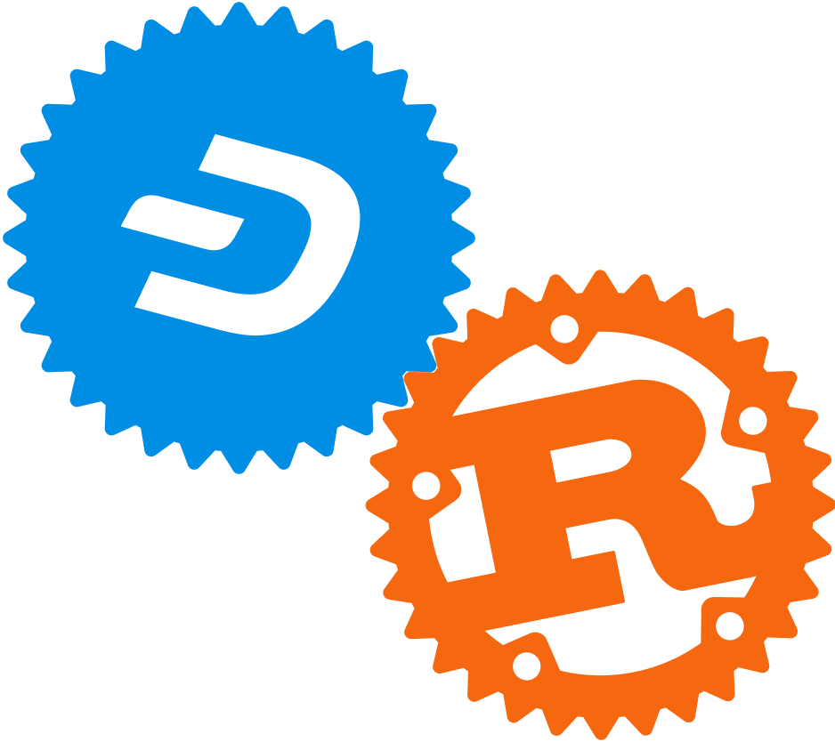

<div align="center">
  <h1>Rust Dash</h1>

  

  <p>Library with support for de/serialization, parsing and executing on data-structures
    and network messages related to Dash Core payment chain. Core RPC client.
  </p>

  <p>
    <a href="https://crates.io/crates/dash"></a>
    <a href="https://github.com/dashpay/rust-dashcore/blob/main/LICENSE"></a>
    <a href="https://github.com/dashpay/rust-dashcore/actions?query=workflow%3AContinuous%20integration"></a>
    <a href="https://codecov.io/gh/dashpay/rust-dashcore/branch/main"></a>
    <a href="https://codecov.io/gh/dashpay/rust-dashcore/branch/dev"></a>
    <a href="https://docs.rs"></a>
    <a href="#minimum-supported-rust-version-msrv"></a>
    
  </p>
</div>

<details>
<summary>Per-crate coverage</summary>

| Group | Crates | Coverage |
|-------|--------|----------|
| core | dashcore, dashcore_hashes, dashcore-private | [](https://codecov.io/gh/dashpay/rust-dashcore?flags[0]=core) |
| spv | dash-spv | [](https://codecov.io/gh/dashpay/rust-dashcore?flags[0]=spv) |
| wallet | key-wallet | [](https://codecov.io/gh/dashpay/rust-dashcore?flags[0]=wallet) |
| ffi | dash-spv-ffi, key-wallet-ffi | [](https://codecov.io/gh/dashpay/rust-dashcore?flags[0]=ffi) |
| rpc | dashcore-rpc, dashcore-rpc-json | [](https://codecov.io/gh/dashpay/rust-dashcore?flags[0]=rpc) |

</details>

For contributors: see CONTRIBUTING.md and AGENTS.md for branch policy and commands.

[Documentation](https://dashcore.readme.io/docs)

Supports (or should support)

* De/serialization of Dash protocol network messages
* De/serialization of blocks and transactions
* Script de/serialization
* Private keys and address creation, de/serialization and validation (including full BIP32 support)
* PSBT creation, manipulation, merging and finalization
* Pay-to-contract support as in Appendix A of the [Blockstream sidechains whitepaper](https://www.blockstream.com/sidechains.pdf)
* JSONRPC interaction with Dash Core
* FFI bindings for C/Swift integration (dash-spv-ffi, key-wallet-ffi)
* High-level wallet management with transaction building and UTXO management
* Dash special transaction data types, including DIP4 coinbase payloads and
  quorum commitments
* Simplified masternode list and QRInfo processing, including optional LLMQ
  commitment and BLS signature validation
* ChainLock and InstantSend lock verification through the masternode list
  engine and `dash-spv`

## Dash verification support

This workspace contains reusable building blocks for applications that need to
verify Dash-specific data without making an RPC call for every operation.
`dashcore` provides the protocol types, hashing, simplified masternode list and
LLMQ machinery, while `dash-spv` adds peer synchronization, persistent header
and compact-filter storage, and ChainLock and InstantSend processing. The
`dash-spv-ffi` crate exposes the SPV client through a C-compatible API suitable
for C, C++, Swift, and other languages that can call a C ABI.

These components do not together form a standalone implementation of all Dash
Core consensus rules. See the consensus limitations below before choosing a
trust model or using them for security-sensitive validation.

# Known limitations

## Consensus

This library **must not** be treated as a drop-in replacement for Dash Core's
full block-validation pipeline. It implements a useful subset of the required
primitives and verification logic, but it does not maintain all of the
consensus state or apply every contextual rule required to independently accept
and construct mainnet blocks.

Notably, the workspace does not currently provide a complete equivalent of
Dash Core's stateful block connection and block-template logic, including all
of the following as one validated pipeline:

* expected-difficulty and complete contextual header validation;
* UTXO state transitions and all transaction and special-transaction rules;
* subsidy, fee, masternode and Platform reward, and coinbase payout checks;
* governance object, superblock trigger, and superblock payout validation;
* asset-lock credit-pool accounting and withdrawal limits; and
* construction of consensus-valid mining templates.

Support for parsing a payload or verifying an individual commitment, quorum,
ChainLock, or InstantSend lock should not be interpreted as validation of the
block and state that produced it. Applications must define their trust and
state model explicitly and use Dash Core when exact agreement with the network's
consensus implementation is required. The C-compatible bindings expose the SPV
and wallet APIs; they are not a general full-consensus validation ABI.

Consensus compatibility is difficult to establish independently of the C++
reference implementation, and known and unknown deviations may exist. Patches
that close specific, tested gaps are welcome.

## Support for 16-bit pointer sizes

16-bit pointer sizes are not supported and we can't promise they will be.
It will be dependent on rust-bitcoin implementing them first.

# Usage
Given below is an example of how to connect to the Dash Core JSON-RPC for a Dash Core node running on `localhost`
and print out the hash of the latest block.

It assumes that the node has password authentication setup, the RPC interface is enabled at port `8332` and the node
is set up to accept RPC connections.

```rust
extern crate dashcore_rpc;

use dashcore_rpc::{Auth, Client, RpcApi};

fn main() {

    let rpc = Client::new(
        "localhost:19998",
                          Auth::UserPass("<FILL RPC USERNAME>".to_string(),
                                         "<FILL RPC PASSWORD>".to_string())).unwrap();
    let best_block_hash = rpc.get_best_block_hash().unwrap();
    println!("best block hash: {}", best_block_hash);
}
```

See `client/examples/` for more usage examples.

# Wallet Management

This library provides comprehensive wallet functionality through multiple components:

* **key-wallet**: Low-level cryptographic primitives for HD wallets, mnemonic generation, and key derivation; and high-level wallet management with transaction building, UTXO tracking, and coin selection
* **key-wallet-ffi**: C/Swift FFI bindings for mobile integration
* **dash-spv**: SPV (Simplified Payment Verification) client implementation

# Supported Dash Core Versions
The following versions are officially supported:
* 0.18.x
* 0.19.x
* 0.20.x
* 0.21.x
* 0.22.x
* 0.23.x

# Minimum Supported Rust Version (MSRV)
This workspace compiles on Rust 1.89 or newer. Crates use mixed editions (2021 and 2024). See CLAUDE.md/AGENTS.md for common commands and CI expectations.


# Documentation

Documentation can be found on [dashcore.readme.io/docs](https://dashcore.readme.io/docs).

# Contributing

Contributions are generally welcome. If you intend to make larger changes please
discuss them in an issue before PRing them to avoid duplicate work and
architectural mismatches.

## Branching Model

Feature work targets the `dev` branch. Submit hotfixes and documentation-only changes to `main` unless maintainers direct otherwise. The `main` branch tracks the latest tagged release. Release branches (`chore/release-vX.Y.Z`) are short-lived, cut from `dev` per release.

## Installing Rust

Rust can be installed using your package manager of choice or
[rustup.rs](https://rustup.rs). The former way is considered more secure since
it typically doesn't involve trust in the CA system. But be aware that the
version of Rust shipped by your distribution might be out of date. See the
MSRV section for the minimum supported version.

## Building

The library can be built and tested using [`cargo`](https://github.com/rust-lang/cargo/):

```
git clone git@github.com:dashpay/rust-dashcore.git
cd rust-dashcore
cargo build
```

You can run tests with:

```
cargo test
```

Please refer to the [`cargo` documentation](https://doc.rust-lang.org/stable/cargo/) for more detailed instructions.

## Pull Requests

Every PR needs at least two reviews to get merged. During the review phase
maintainers and contributors are likely to leave comments and request changes.
Please try to address them, otherwise your PR might get closed without merging
after a longer time of inactivity. If your PR isn't ready for review yet please
mark it by prefixing the title with `WIP: `.

### CI Pipeline

The CI pipeline requires approval before being run on each MR.

In order to speed up the review process the CI pipeline can be run locally using
[act](https://github.com/nektos/act). The `fuzz` and `Cross` jobs will be
skipped when using `act` due to caching being unsupported at this time. We do
not *actively* support `act` but will merge PRs fixing `act` issues.


## Release Notes

See [CHANGELOG.md](CHANGELOG.md).


## Licensing

The code in this project is licensed under the [Creative Commons CC0 1.0
Universal license](LICENSE).
